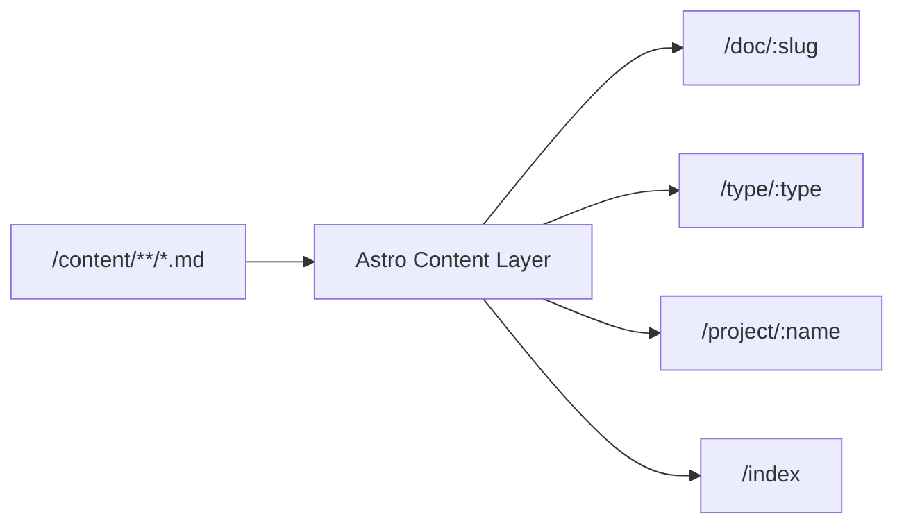

Octa is not a blog. It's a structured notebook for engineering thinking — closer to an internal memo system than a publishing platform. This document records the decisions made during its initial construction.

## What it needs to do

The core requirement is *durable technical writing* that stays readable without maintenance. That means:

- No database. No CMS. No API dependencies.
- Content portable as plain Markdown.
- Fast enough to not think about performance.
- Simple enough to not break over time.

The anti-requirements were equally clear: no SEO optimization, no engagement mechanics, no social features.

## Framework: Astro 6

Static generation with minimal client-side JavaScript was the primary constraint. Astro satisfies this better than the alternatives:

**Next.js (static export)** ships a React runtime by default. Even a static export loads the hydration layer. For a content site that needs exactly one interactive feature (Mermaid diagrams), that's excess weight.

**Astro** generates pure HTML by default. JS islands are opt-in per component. The entire site — sidebar, navigation, article layout — runs zero client JS except the Mermaid renderer on article pages.

The tradeoff: Astro's Content Layer API (v5+) has a strict isolation requirement for `getStaticPaths`. Any module-level constant referenced inside the function must be re-declared inline, because the function runs in a separate build scope. This is a footgun worth documenting.

## Content model

Six content types map to six Astro collections:

```
/content/architecture   → system design, tradeoffs
/content/runtime        → browser behavior, scheduling
/content/pulse          → the Pulse observability project
/content/systems        → long-form reasoning
/content/notes          → short-form technical notes
/content/investigations → (legacy, not exposed in navigation)
```

All share a single frontmatter schema:

```yaml
title: string
date: date
tags: string[]
project: string?      # cross-cutting — links to /project/:name
series: string?       # groups sequential posts
pinned: boolean       # surfaces in sidebar "Pinned" count
status: published | draft
```

The `project` field is the key architectural choice. Types categorize *what kind of content* something is. Projects categorize *what it's about*. An architecture note about Pulse's ingestion pipeline has `type: architecture` and `project: pulse`. Both lenses are available from the sidebar without duplication.

## URL structure

```
/doc/:slug      → individual articles
/type/:type     → type index pages
/project/:name  → project index pages
```

Flat `/doc/:slug` means slugs must be unique across all content directories. This is a mild constraint in practice — filenames that describe the content are naturally unique. The benefit is clean URLs without implementation leaking into them. A document about scheduler behavior doesn't need `/runtime/` in its URL.

## Sidebar design

The sidebar has three groups in a single scroll:

1. **Index** — aggregate views (all, this month, pinned, drafts)
2. **Types** — the five active content types
3. **Projects** — derived at build time from `project` frontmatter values across all collections

The Projects group is dynamic: it only renders if at least one published document has a `project` field. No configuration required to add a new project — write a document with the field and it appears.

Originally the sidebar had a tab switcher between Sections and Projects. This was removed. Tabs imply that only one view is useful at a time, which creates a navigation hierarchy that doesn't exist conceptually — Types and Projects are parallel classification systems, not alternatives.

## Design system

The visual system follows the Observatory brief: dark-only, no rounded corners, no gradients, hairline rules, monospace metadata.

The accent color (`oklch(74% 0.07 240)` — desaturated blue) is used structurally, not decoratively:

- Active nav item
- Type labels in tables
- Project badge in article breadcrumb
- Build status dot

Nowhere else. This keeps the accent meaningful as a signal rather than a decoration.

Fonts are self-hosted Geist variable fonts (woff2) copied from the `geist` npm package to `/public/fonts/`. This avoids Google Fonts requests and keeps the font stack self-contained. The variable format covers the weight range (300–500) used across the UI in a single file per typeface.

## Mermaid diagrams

Diagrams render client-side using the `mermaid` npm package. The approach:

1. Astro renders `\`\`\`mermaid` code blocks as `<pre><code class="language-mermaid">...</code></pre>` in the HTML.
2. A `<script>` in `ArticleLayout.astro` queries all `.language-mermaid` elements, replaces each `<pre>` with a container `<div>`, and calls `mermaid.render()`.

This works for both `.md` and `.mdx` files without a remark plugin or build-time headless browser. The tradeoff is that diagrams require JS — acceptable for a technical audience.

The mermaid theme is configured to match the Observatory design system:

```js
mermaid.initialize({
  theme: 'base',
  themeVariables: {
    primaryColor:       '#171c25',
    primaryTextColor:   '#dde0e6',
    lineColor:          'rgba(255,255,255,0.35)',
    fontFamily:         'Geist Mono, ui-monospace, monospace',
  },
});
```

Example diagram — the content routing architecture:



## What was left out

**Search** (Pagefind) — deferred. The table layout on the homepage already functions as a scannable index. Search adds value at volume (50+ documents).

**Series linking** — the `series` field is stored in frontmatter and displayed in article metadata, but there's no "previous / next" navigation yet. At low volume this isn't needed.

**Light mode** — explicitly out of scope. A dark engineering notebook with a single theme is simpler to maintain and fits the target aesthetic.
