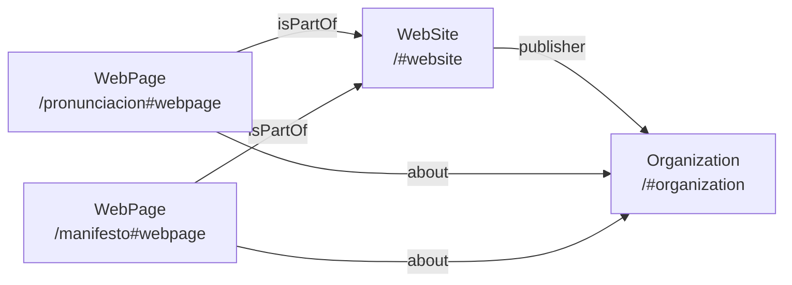

When a brand name is shared by multiple unrelated entities — a watch retailer, a consulting firm, a capital fund — Google has no reliable way to determine which result belongs to which entity unless the sites themselves publish structured signals. For a minimal site with a single indexed page, the problem is acute: no content volume, no backlink density, no topical authority. The only lever is the entity graph.

## The Problem with Unnamed Entities

A JSON-LD block without `@id` is a hint. Google reads it, may or may not associate it with a Knowledge Graph node, and continues. Two sites publishing the same `"name": "Avelor"` with no canonical identifier produce ambiguous signals that Google resolves arbitrarily — usually by favoring whichever has more content or backlinks.

`@id` changes this. It declares a URI as the canonical identifier for the entity, making the JSON-LD node addressable and linkable across documents:

```json
{
  "@context": "https://schema.org",
  "@type": "Organization",
  "@id": "https://avelor.es/#organization",
  "name": "Avelor"
}
```

Any other document that references `"@id": "https://avelor.es/#organization"` is now making a verifiable claim about the same node — not about a similarly-named entity.

## The Three-Node Graph

A minimal site needs at minimum three nodes to establish a coherent entity graph:



`WebSite` → `Organization` via `publisher` establishes that the domain is owned by the entity. `WebPage` → `Organization` via `about` tells Google that each page is *about* the entity, not merely hosted there. Without the `about` relation, secondary pages are just pages — they don't strengthen entity recognition.

In practice, both the `WebSite` and `Organization` nodes live in a single JSON-LD array on the homepage:

```json
[
  {
    "@context": "https://schema.org",
    "@type": "WebSite",
    "@id": "https://avelor.es/#website",
    "url": "https://avelor.es",
    "name": "Avelor",
    "publisher": { "@id": "https://avelor.es/#organization" }
  },
  {
    "@context": "https://schema.org",
    "@type": "Organization",
    "@id": "https://avelor.es/#organization",
    "name": "Avelor",
    "url": "https://avelor.es",
    "foundingDate": "2018",
    "logo": {
      "@type": "ImageObject",
      "@id": "https://avelor.es/#logo",
      "url": "https://avelor.es/og-image.png",
      "width": 1200,
      "height": 630
    },
    "sameAs": [
      "https://www.linkedin.com/company/avelor-es/",
      "https://github.com/avelor-es",
      "https://www.wikidata.org/wiki/Q139894905",
      "https://wellfound.com/company/avelor"
    ]
  }
]
```

## sameAs as Cross-Domain Corroboration

`sameAs` is where external profiles become structural. Each entry is a claim that the listed URL represents the same real-world entity. Google cross-references these: if LinkedIn, GitHub, Wikidata, and Wellfound all describe something called "Avelor" with `avelor.es` as the website, the entity is corroborated from four independent sources.

The order of `sameAs` entries doesn't matter. Coverage does. Wikidata carries disproportionate weight because it is Google's primary source for Knowledge Graph entities — a Wikidata entry with `P856` (official website) pointing to the domain creates a bidirectional link that Google can verify.

## rel="me" as the HTML Layer

JSON-LD operates at the semantic layer. `rel="me"` operates at the HTML layer and is processed independently by Google (and IndieWeb-aware tools). Publishing both for the same set of profiles removes the dependency on Google's JSON-LD parser being authoritative:

```html
<link rel="me" href="https://github.com/avelor-es" />
<link rel="me" href="https://www.linkedin.com/company/avelor-es/" />
<link rel="me" href="https://www.wikidata.org/wiki/Q139894905" />
<link rel="me" href="https://wellfound.com/company/avelor" />
```

These live in `<head>` on every page via the shared layout, so every URL on the domain carries the ownership signal — not just the homepage.

## Choosing Which Pages to Index

The standard advice for minimal brand sites is to index only the homepage. The counterintuitive move is to index pages whose *content is about the brand name itself* — even if they have no conventional SEO value.

A pronunciation guide (`/pronunciacion`) is a page whose entire subject is the word "Avelor": its phonetics, its syllable stress, its distinctiveness. Google indexes this as a document whose topic is the brand name. A manifesto whose every paragraph invokes the same name does the same. Neither page targets keywords. Both pages reinforce entity identity.

The constraint is that these pages must not collapse the brand into a market vertical. A `/services` page indexed with keywords like "software consulting Mexico" creates topical associations that constrain how Google categorizes the entity. Pages about the name, the philosophy, the pronunciation — these are safe.

## logo as ImageObject

Declaring `logo` as a plain URL string works but leaves resolution ambiguous. As an `ImageObject` with explicit dimensions:

```json
"logo": {
  "@type": "ImageObject",
  "@id": "https://avelor.es/#logo",
  "url": "https://avelor.es/og-image.png",
  "width": 1200,
  "height": 630
}
```

Google uses the logo in the Knowledge Panel. The `@id` on the `ImageObject` makes it referenceable from other entities if the domain ever expands to multiple sub-brands.

## What This Doesn't Solve

Entity graphs establish identity. They do not generate rankings for non-branded queries. A site with one indexed page and no backlinks will not appear for any search term that isn't the brand name itself, regardless of how complete the structured data is.

The graph is a precondition for Knowledge Panel appearance and branded search consolidation — nothing more. External corroboration (editorial backlinks, directory listings, Google Business Profile) is what converts a well-formed graph into visible search presence.
