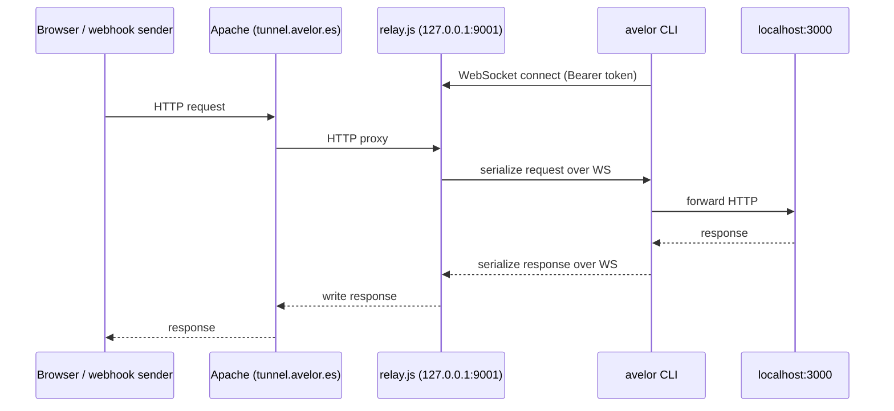

A tunnel that exposes `localhost:3000` at a public HTTPS URL doesn't need SSH. A WebSocket relay achieves the same result with nothing but an outbound connection from the developer's machine, a small Node.js process on the server, and a shared secret for auth. No keys to distribute, no port forwarding rules, no firewall exceptions.

## The problem with SSH reverse tunnels in public CLIs

`ssh -R 9000:localhost:3000 user@server -N` works, but it requires the user to have an SSH key authorized on the server. That's fine for a private tool. The moment the CLI becomes public, every user needs their own SSH key provisioned — which means a registration flow, key management, and a security surface on the server's `authorized_keys`. Token-based auth is simpler and easier to revoke.

## Architecture



The relay process listens only on `127.0.0.1`. Apache handles TLS and proxies both HTTP traffic and the WebSocket upgrade to the relay. The CLI initiates the only outbound connection — no inbound ports are opened on the developer's machine.

## Request lifecycle

Every incoming HTTP request becomes a message on the WebSocket channel. The relay assigns a `uuid` to the request and stores a reference to the `res` object in a `Map`:

```javascript
const id = randomUUID();
queue.set(id, { res, timer });
peer.send(JSON.stringify({ id, method, url, headers, body }));
```

The body is base64-encoded to survive JSON serialization cleanly across binary payloads (file uploads, compressed responses, etc.).

The CLI receives the message, forwards it to the local server as a plain HTTP request, and sends back:

```javascript
{ id, status, headers, body }  // body is base64
```

The relay looks up the `id` in the queue, writes the response headers and body, and resolves the original HTTP request. From the browser's perspective it was a normal round-trip.

If the CLI doesn't respond within 30 seconds, the relay times out with a 504 and removes the pending entry. If the WebSocket disconnects mid-flight, all pending requests are resolved with 502.

## Apache configuration

Two proxy rules are needed: one for the WebSocket handshake, one for regular HTTP traffic.

```apache
# WebSocket upgrade — must come before the catch-all ProxyPass
RewriteEngine On
RewriteCond %{HTTP:Upgrade} websocket [NC]
RewriteCond %{HTTP:Connection} upgrade [NC]
RewriteRule ^/_tunnel$ ws://127.0.0.1:9001/_tunnel [P,L]

ProxyPass        / http://127.0.0.1:9001/
ProxyPassReverse / http://127.0.0.1:9001/
```

`mod_proxy_wstunnel` handles the WebSocket leg. The rewrite rule targets only `/_tunnel` so that all other paths fall through to the HTTP proxy and get relayed as tunneled requests.

## Auth

The CLI sends `Authorization: Bearer <token>` in the WebSocket handshake headers. The relay checks it before accepting the connection:

```javascript
wss.on('connection', (ws, req) => {
  const auth = (req.headers['authorization'] || '').trim();
  if (auth !== `Bearer ${TOKEN}`) {
    ws.close(1008, 'unauthorized');
    return;
  }
  // ...
});
```

The token is transmitted only over TLS (Apache enforces HTTPS), and it lives in the CLI's local config file — never in the URL or logs. Since this is a single-user tool, there's also a hard limit of one active connection at a time: a second `connect` event closes the new socket immediately.

## The `--run` flag

`avelor tunnel 3000 --run "npm run dev"` spawns the child process first, then polls `127.0.0.1:3000` with HEAD requests at 500ms intervals until the port accepts connections. Only then does it open the WebSocket. This avoids the race condition where the tunnel is active before the dev server is ready.

```javascript
function waitForPort(port, timeout = 30_000) {
  return new Promise((resolve, reject) => {
    const deadline = Date.now() + timeout;
    function attempt() {
      const req = http.request({ hostname: '127.0.0.1', port, method: 'HEAD', path: '/' }, () => resolve());
      req.on('error', () => {
        if (Date.now() >= deadline) return reject(new Error(`port ${port} not ready`));
        setTimeout(attempt, 500);
      });
      req.end();
    }
    attempt();
  });
}
```

On `SIGINT`, the CLI closes the WebSocket and kills the child process.

## Trade-offs

**Single connection** is a deliberate constraint. The relay was designed for testing webhooks locally, not for serving production traffic. One active tunnel keeps the relay stateless and the auth model trivial.

**Full buffering** — requests and responses are fully buffered before forwarding. This means no streaming support and an implicit limit on payload size (whatever fits in Node's default buffer). For the webhook testing use case this is fine; for anything involving large file uploads it would need chunked forwarding over multiple messages.

**No subdomain isolation** — there is one fixed public URL. This is intentional: a wildcard subdomain would require a wildcard TLS certificate and dynamic nginx/Apache config. The simpler model is one URL, one user, one token.
