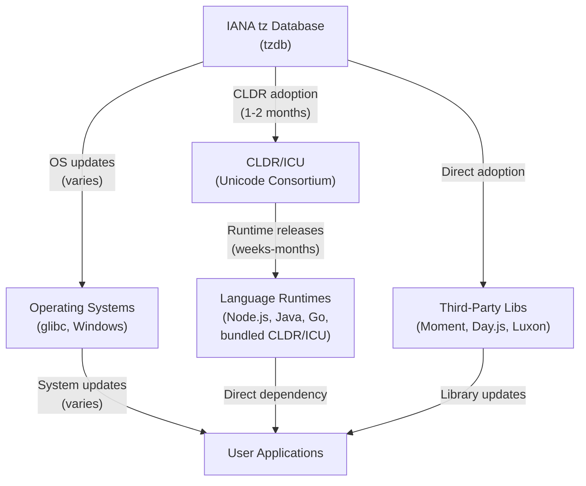

When the IANA timezone database makes a decision about how time works in a region, that change doesn't instantly reach your JavaScript `Date` object or your Python datetime library. Instead, it travels through a complex ecosystem of standards bodies, operating systems, language runtimes, and third-party libraries—each with their own release cycles, prioritization strategies, and sometimes their own interpretations of the rules.

This journey can take weeks, months, or in extreme cases, never happen at all. Understanding that pipeline is essential for anyone building systems that rely on reliable timezone handling.

## The Propagation Pipeline



## Timeline: From IANA Decision to User System

**tz release** (immediate)
- IANA releases a new rule via the [tz mailing list](https://lists.iana.org/hyperkitty/list/tz@iana.org/) and updates [data.iana.org/time-zones/tzdb/](https://data.iana.org/time-zones/tzdb/)
- Published in the NEWS file

**CLDR adoption** (typically 1–2 months)
- Unicode CLDR interprets the tz change and integrates it into its schema
- CLDR includes not just tz rules but also metadata: display names, exemplar cities, etc.
- Not always a 1:1 mapping (CLDR sometimes applies its own interpretation)

**OS updates** (highly variable)
  - **Linux distributions**: 1–3 months (depends on distro policy)
  - **macOS**: aligned with CLDR releases, typically 1–2 months
  - **Windows**: can lag significantly; Microsoft maintains its own TZDB mirror but updates are not automatic
  - **Android**: depends on the OS version and manufacturer updates

**Language runtime releases** (weeks to months)
  - Runtimes with bundled CLDR (Node.js, Java, Go) release updates on their own schedule
  - Some runtimes are more aggressive (quick releases); others batch changes

**Third-party libraries** (unpredictable)
  - Some libraries depend on CLDR and are updated automatically
  - Others maintain their own timezone data
  - Maintainer activity is critical—abandoned libraries can lag for years

## Node.js: The Duality Problem

Node.js presents a unique and often overlooked situation: it has **two simultaneous sources of timezone information**.

### Source 1: Native `Date` (from the Operating System)

The JavaScript `Date` object relies on the system's tzdata:

```javascript
const now = new Date();
now.toString(); 
// Uses the OS tzdata to determine local timezone offset
```

When you call `new Date()` and ask for the local representation, Node.js queries the operating system's timezone database (via `libc` on Unix-like systems, the Windows Registry on Windows). If your OS hasn't updated its tzdata yet, your `Date` object won't reflect the latest rules either.

### Source 2: `Intl.DateTimeFormat` (from Bundled ICU)

The Intl API is built on ICU (International Components for Unicode), which is bundled into the Node.js binary:

```javascript
const formatter = new Intl.DateTimeFormat('ca-AD', {
  timeZone: 'Europe/Andorra',
});
// Uses bundled ICU data, which can differ from OS data
```

This formatter uses the CLDR/ICU data that was compiled into your Node.js binary at build time. If your Node.js version was built 6 months ago and tz made a change last week, the `Intl` API will use outdated data until you upgrade Node.

### The Mismatch

The same JavaScript environment can give you *two different answers* for the same timezone:

```javascript
// Example: hypothetical timezone rule change
const d = new Date('2026-06-15T12:00:00Z');

// Using Date (OS-based)
console.log(d.toLocaleString('en-US', { timeZone: 'America/New_York' }));
// May use outdated rules if OS hasn't updated

// Using explicit Intl (ICU-based)
const formatter = new Intl.DateTimeFormat('en-US', { 
  timeZone: 'America/New_York' 
});
console.log(formatter.format(d));
// May use different rules if Node.js binary is newer than OS
```

This split is a well-known pain point in JavaScript environments. Different environments handle it differently—some prefer OS consistency, others prefer Intl consistency.

## Case Study: British Columbia's Permanent Daylight Time

British Columbia (Canada) announced in late 2023 that it would permanently observe daylight time—effectively staying on "summer time" year-round. This created a problem that exposed the limits of CLDR's design.

CLDR's mental model assumes regions transition between **a standard time and a daylight time**. Every year, the clock springs forward and falls back. But British Columbia doesn't follow this pattern anymore. It stays on daylight time constantly.

When a region stops participating in the normal DST cycle entirely, CLDR has no natural way to represent it. The schema assumes transitions happen *periodically* (spring forward, fall back). A permanent shift breaks that assumption.

### IANA's Workaround

Rather than wait for CLDR to redesign its schema, IANA's timezone maintainers invented a solution: **a fictional future DST transition**.

The tz database now schedules a fake DST transition far in the future. On that date, the region transitions from "summer time" to... "summer time" again. The net effect: no actual time change, but the CLDR rules engine processes it as a normal transition and produces the correct output.

From the `tzdata` NEWS file:

> A region that wants to stay on permanent daylight time can be represented as having a DST transition that loops back to itself, effectively freezing the clock in the DST state.

This is a clever hack, but it reveals an important truth: **the timezone database is constrained by the tools that consume it**. IANA doesn't just define rules; it also has to work around limitations in the systems that implement those rules.

The specific discussion:
- [IANA tz mailing list thread on British Columbia](https://lists.iana.org/hyperkitty/list/tz@iana.org/thread/NZCHEWN5WZWIC3OQDNHBX4U7Z4PTCJYY/)
- [IANA tzdb NEWS file](https://data.iana.org/time-zones/tzdb/NEWS) (search for "Canada/Vancouver" or "permanent")

## Why Propagation Matters

The reality of timezone propagation creates several practical implications:

1. **You can't rely on immediate consistency.** A timezone rule change made today won't be reflected everywhere in your infrastructure for weeks or months.

2. **Cross-system mismatches are possible.** Your web server (running a freshly updated OS) might calculate time differently than the user's browser (running an older version of Node or Chrome).

3. **Library choice matters.** Moment.js might reflect changes faster than the native `Date` object, or vice versa, depending on when maintainers push updates.

4. **CI/CD and testing become essential.** If you care about correct timezone behavior, you can't just trust whatever system you're testing on. You need explicit tests for known edge cases and irregular transitions.

## What to Do

If you're building systems that handle timezone-dependent logic:

- **For coordination:** Always store and transmit times in UTC. Conversion to local time is a *display* concern, not a storage concern.
- **For testing:** Don't assume your system's timezone data is current. Write tests that explicitly test known edge cases and transitions.
- **For Node.js:** Be aware that `Date` and `Intl` can disagree. For critical applications, pick one and stick with it, or synchronize them explicitly.
- **For production:** Monitor timezone-related issues in your observability stack. A timezone propagation delay is invisible until someone tries to book a flight.
